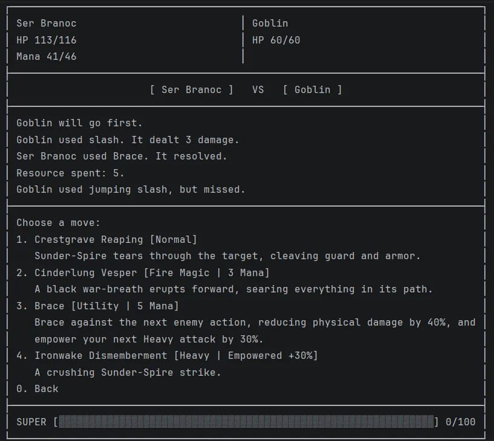
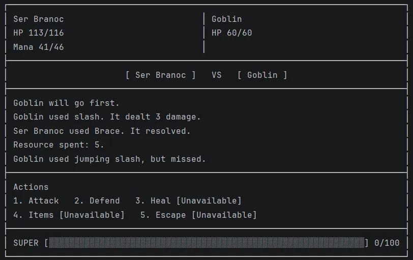
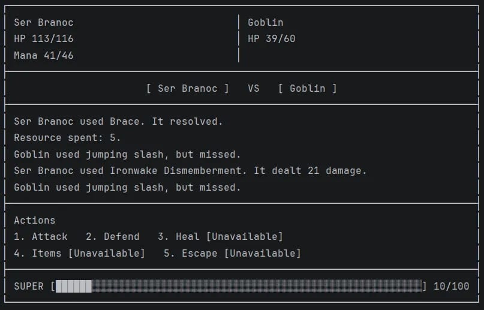

# Dungeon Drifters

Dungeon Drifters is a text-based Python RPG prototype set in the land of Ketlyv.

The current repository checkpoint is **v0.2.9**. This is the completed
structured Goblin Battle, stat-scaling, M8 hardening, and M9 UI/engine
separation checkpoint between **v0.2** and the unfinished **v0.3** release.
The playable baseline is still a small Goblin vertical slice, but it now runs
through structured moves, the combat resolver, encounter-owned combat state,
and a renderer-neutral presentation boundary. M9 character identity mechanics
are live in the combat slice.

## Current Playable State

The playable flow is intentionally small:

```text
title screen
  -> Drifter selection
  -> opening story
  -> attack or flee
  -> Goblin encounter or escape
  -> victory or defeat ending
```

Current Drifter selection uses canonical profile identity layered over the
existing mechanical archetypes:

- Ser Branoc, the Unbroken Crest - Brawler
- Azhvielle, the Unconfessed - Black Mage
- Zhaivra Kelyth, the Uncontrolled Reagent - Rogue Archer
- Joruun Veyr, the Bloody Storm Monk - Monk

The Goblin encounter now uses the structured combat path. The main battle menu
currently presents:

- Attack
- Defend
- Heal
- Items
- Escape

Attack and Super open structured move submenus when eligible moves are
available. Heal is a universal self-heal action with a three-action cooldown.
Defend is a core combat action. Items opens each character's personal run
inventory; Zhaivra can prepare Fire or Poison Infused Barb payloads. Escape
remains visible but disabled. Super is persistently visible through the meter
and opens its submenu when ready.

Branoc's Brace, Azhvielle's Gravemantle and Frost routes, Zhaivra's Burn and
Poison infusions, and Joruun's Water, Air, Lightning, and Stun mechanics are
implemented through the resolver and encounter-local state boundaries.

## Play Instructions

From the project root, run:

```powershell
.\.venv\Scripts\python.exe src\run_game.py
```

You can also run `src/run_game.py` directly from PyCharm.

During play:

1. Press Enter past the title screen.
2. Choose a Drifter.
3. Confirm or return to selection.
4. Read the opening story.
5. Choose to attack or flee.
6. If combat starts, choose Attack, Defend, Heal, Items, or Escape.
7. Use Heal when damaged and ready; it becomes available again after three
   later accepted actions by that character.
8. Use the persistent Super meter to open the Super submenu when ready.

## Balance Snapshot

The permanent M9 balance probe captures the pre-progression roster with fixed
seed banks and real combat routes:

```powershell
.\.venv\Scripts\python.exe tools\balance_probe.py
```

Each run records Markdown, raw JSON, and metadata under
`tools/balance_probe_outputs/<run_id>/`. The canonical M9 snapshot uses eight
route policies, 25 Goblin seeds, 100 stress seeds, and 1,000 total encounters.
It also records natural Super usage and the exact commit, seed corpus, and
route policy versions used for the run. Generated runs are ignored so they can
be retained locally and zipped for later balance review.

## Screenshots

The current terminal presentation is shown below:



*Structured move menu showing authored roles, resource costs, Brace rules, and the dynamic Ironwake payoff label.*



*Battle HUD showing the five ordinary actions, unavailable-state labels, bounded battle log, and persistent Super meter.*



*Battle log after Brace and an empowered Ironwake Dismemberment action.*

## Implemented Architecture

The repository now includes these active foundations:

- `GameState` as the session root for one active run.
- `PlayerState`, `StoryState`, and `WorldState` ownership boundaries.
- Separated character runtime state, loadout definitions, and profile identity.
- Canonical character profiles for the four current Drifters.
- Per-character loadout modules for identity metadata, starting stats, legacy
  move names, and structured combat moves.
- Health, mana, level, EXP, permanent stats, and effective stat access.
- Central player stat-scaling helpers for HP, Mana, output scaling, physical
  negation, accuracy, dodge, Super gain, and crit chance.
- Inventory, gold, and equipment slot state on `PlayerState`.
- Immutable validated `Move` definitions.
- Immutable validated `MoveResult` as the structured combat result contract.
- Inert authored move-presentation metadata for roles, affinities, and summaries.
- Shared `Combatant` protocol for player and enemy runtime state.
- Runtime `EnemyState` with independent health, mana, stats, and structured
  enemy moves.
- Enemy archetype metadata for rank, role, behavior, capabilities, and tier.
- `app.combat` contains reusable combat rules and contracts, while
  `app.enemies` contains enemy definitions, runtime state, registration,
  scaling, factory, and authored enemy content.
- Core Defend contract integrated into Battle as a resolver-backed core action,
  not an authored `Move`.
- Battle consumes `CombatResolver` and passes `CombatState` into resolver calls.
- Battle reads player moves from `player_state.combat_moves` and enemy moves
  from `foe.combat_moves`.
- Accepted combat actions complete through
  `CombatState.complete_accepted_action(...)`.
- `BattlePresenter` converts read-only domain state and semantic events into
  immutable `BattleView` models.
- `BattlePresentationSession` owns bounded encounter-local structured log
  history.
- `TerminalBattleUI` owns terminal layout, wrapping, ANSI/Unicode fallback,
  input translation, and rendering, but no combat state or history.
- Battle accepts typed semantic input, validates it against the offered view,
  and contains no direct terminal `input()` or `print()` calls.
- The resolver owns validation, resource spending, accuracy, damage, healing,
  Super behavior, and result creation.
- Player starting HP and Mana now derive from Constitution, Spirit, and level
  through the stat-scaling contract instead of hardcoded archetype resource
  constants.
- Combat damage output now uses basis-point primary stat scaling instead of raw
  additive stat damage, and ordinary physical negation, accuracy, dodge, Super
  gain, and crit chance are wired through the shared scaling helpers.
- Serializable `PlayerState` and `GameState` snapshots.
- Defensive copies or immutable views for state collections where currently
  implemented.

These systems form the current gameplay and architecture foundation. The
Goblin encounter is fully on the structured combat path, while broader
gameplay systems remain under development.

## Resource Terminology

The active `Move` resource categories are:

- `None`
- `Mana`
- `Super`

Momentum is deferred shared encounter state. It is not an active move resource.

Ki may appear as Joruun identity or technique flavor. It is not an active
resource state.

Momentum and Ki meters remain deferred. Character-specific compounds and
prepared infusions are active through each character's personal run state;
they are not shared party resources.

## Test Instructions

Install development dependencies:

```powershell
.\.venv\Scripts\python.exe -m pip install -r requirements-dev.txt
```

Run the full pytest suite:

```powershell
.\.venv\Scripts\python.exe -m pytest
```

Run a compile check:

```powershell
.\.venv\Scripts\python.exe -m compileall src tests
```

## Project Structure

```text
Dungeon-Drifters/
+-- .github/
|   +-- workflows/
|       +-- tests.yml
+-- src/
|   +-- app/
|   |   +-- combat/
|   |   +-- enemies/
|   |   +-- game/
|   |   +-- items/
|   |   +-- player/
|   |   +-- presentation/
|   |   +-- ui/
|   |   +-- world/
|   +-- run_game.py
+-- tests/
+-- docs/
+-- README.md
+-- .gitignore
+-- pytest.ini
+-- requirements-dev.txt
```

The complete runnable game is contained under `src/`. Tests, documentation,
GitHub Actions, and development configuration remain outside the distributable
game directory.

## Change Summary

### v0.1

v0.1 established the first complete playable slice:

- restored a clean root launcher
- fixed character selection
- fixed story execution order
- connected story choices to battle or escape
- added deterministic smoke coverage for attack and flee paths
- kept the first playable loop focused on one Goblin encounter

### v0.2

v0.2 added the first persistent state foundation:

- refactored the project into domain packages
- added structured move data for playable classes
- implemented `Health`, `Mana`, `Level`, `Exp`, and stat objects
- preserved legacy `Character` attributes through compatibility properties
- added `PlayerState` for selected character, gold, inventory, and equipment
- created `PlayerState` in the main flow
- changed `Battle` to receive player runtime state
- moved player HP mutation into persistent `PlayerState.health`
- added `CombatState` as temporary per-battle state

### v0.2.5

v0.2.5 is the architecture checkpoint currently merged through Milestone 6:

- added canonical Drifter profiles and profile-attached character identity
- added compact character selection and profile confirmation flow
- added console screen transitions
- added `GameState`, `StoryState`, and `WorldState`
- added serializable `PlayerState` and `GameState` snapshots
- separated character loadout definitions from runtime state
- migrated to six permanent stats
- added validated resource and stat mutation boundaries
- added shared `Combatant` protocol
- added `EnemyState` and moved enemy runtime HP out of Battle-owned integers
- normalized enemy moves as structured `Move` definitions
- added validated `Move` and `MoveResult` contracts
- clarified active move resources as `None`, `Mana`, and `Super`
- preserved the v0.1 vertical slice while preparing for later resolver work

### v0.2.7

v0.2.7 adds the standalone Milestone 7 combat resolver and related pre-M8
contracts:

- added `CombatResolver` for canonical actor-owned structured moves
- added deterministic accuracy, scaling, mitigation, damage, and healing rules
- added Mana and persistent Super spending/generation in resolver flow
- added enemy archetype, rank, role, behavior, capability, and tier metadata
- corrected the ordinary Goblin to a two-move common `BASIC_ATTACKS` roster
  with 0 Mana
- moved enemy definitions, runtime state, registration, factory, scaling, and
  authored Goblin content into `app.enemies`
- added the core Defend contract for resolver-level damage reduction and
  temporary encounter-owned defending state
- completed the current structured Branoc, Azhvielle, and Zhaivra active
  rosters as four standard attacks plus one Super each
- preserved unsupported character-specific effects as deferred comments instead
  of active mechanic tags
- kept the interactive `Battle` loop on the legacy path for Milestone 8
- documented that complete structured Battle playability still depends on M8
  integration and remaining character-kit/mechanic work

### v0.2.8

v0.2.8 completes the Milestone 8 structured Goblin Battle integration:

- rewired player-selected structured moves through `CombatResolver`
- rewired ordinary Goblin enemy actions through authored structured moves
- added structured Attack and Super submenus to the terminal Battle flow
- integrated Defend as a core resolver-backed action
- routed accepted action completion through `CombatState`
- rendered Battle output from `MoveResult` values
- expanded the terminal HUD to show HP, Mana, Super, Defend, and relevant
  temporary combat state
- removed legacy Battle-owned attack, recovery, miss, damage, and universal
  enemy-healing helpers
- verified the Goblin vertical slice from character selection through victory
  using structured moves and resolver-backed combat

### v0.2.8.5

v0.2.8.5 adds the first post-M8 stat-scaling pass and targeted hardening:

- added the central `app.player.scaling` contract for all six permanent stats
- moved authored starting Level 1 stat distributions into player loadout modules
- derived player HP from Constitution and player Mana from Spirit, including
  level-based resource growth through explicit recalculation
- replaced raw additive damage scaling with basis-point output scaling for
  Strength, Dexterity, and Intelligence
- wired Strength physical negation into incoming physical damage
- wired Dexterity accuracy and dodge into ordinary hit chance
- wired Intuition Super gain scaling into landed non-Super damage hits
- wired Intuition crit chance into landed damage moves and surfaced crit state
  through `MoveResult`
- updated Battle rendering to visibly show critical hits
- added resolver compatibility coverage proving all four authored Drifter
  structured move rosters enter the resolver path successfully
- completed an M8 hardening audit across combat, player, enemy, snapshot, and
  progression boundaries without changing move data, enemy data, or Battle flow

### v0.2.9

v0.2.9 completes the M9 UI/engine separation milestone:

- added a controlling UI/engine separation plan in
  `docs/m9-ui-engine-separation.md`
- added immutable renderer-neutral battle presentation models
- added a pure `BattlePresenter` and bounded structured battle log session
- replaced raw Battle menu input with typed semantic action, move, and Back
  intents
- moved terminal rendering and input handling into a stateless
  `TerminalBattleUI`
- kept Battle responsible for orchestration, resolver calls, accepted-action
  completion, and victory/defeat flow
- added the persistent Super meter and five-option ordinary action hierarchy
  with disabled Items and Escape states
- restored universal Heal as a resolver-backed self-heal with a three-action
  cooldown, without adding healing moves to character loadouts
- added structured move roles, affinities, summaries, and dynamic Brace and
  Ironwake presentation without consuming combat state
- verified all four Drifters through resolver compatibility tests and
  deterministic Goblin vertical slices
- removed the obsolete private Battle menu bridge after the UI migration
- completed the four Drifter identity pass with encounter-local mechanics for
  Brace, Gravemantle, Frost, Infused Barb, Burn, Poison, Conductive,
  Turbulence, Lightning Storm, Stun, and universal Heal
- added the deterministic M9 balance snapshot tool with fixed 25-seed Goblin,
  100-seed stress, eight-route, and natural Super-usage coverage

## Known Limitations

- In-battle Escape remains visible but is not yet wired.
- Heal is a universal self-heal that restores 10-16 HP plus effective
  Constitution and becomes available again after three later accepted
  actions by that character.
- Character balance remains provisional pending larger enemies, progression,
  and future M10 content.
- Exact combat formulas and balance are provisional.
- XP, Growth Points, secured/unsecured extraction loops, and reward persistence
  remain parked for a later progression milestone.
- Momentum implementation is deferred.
- The current inventory and infusion loop is limited to the authored M9
  compounds and payloads; broader loot and crafting systems remain future
  work.
- Status effects and elemental interactions are limited to the authored M9
  mechanics; no general effect scripting system exists.
- Enemy AI is still simple random selection from authored structured moves.
- Multi-enemy, party-targeting, and area-targeting encounters are not
  implemented.
- Equipment currently contributes through `effective_stat()` where applicable.
- Broader encounters, progression gameplay, shops, extraction, and save/load
  remain future work.

## Development Notes

- Use the project virtual environment at `.venv`.
- Use `.\.venv\Scripts\python.exe` for commands.
- Pytest is the canonical test runner.
