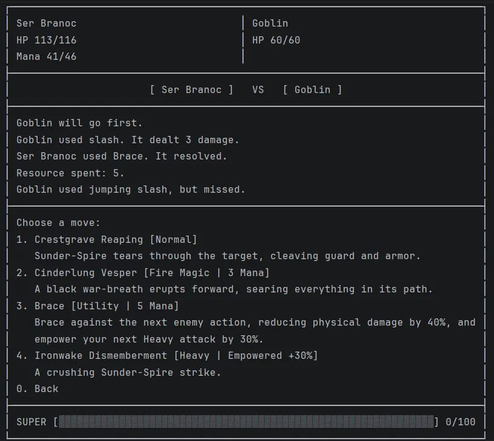
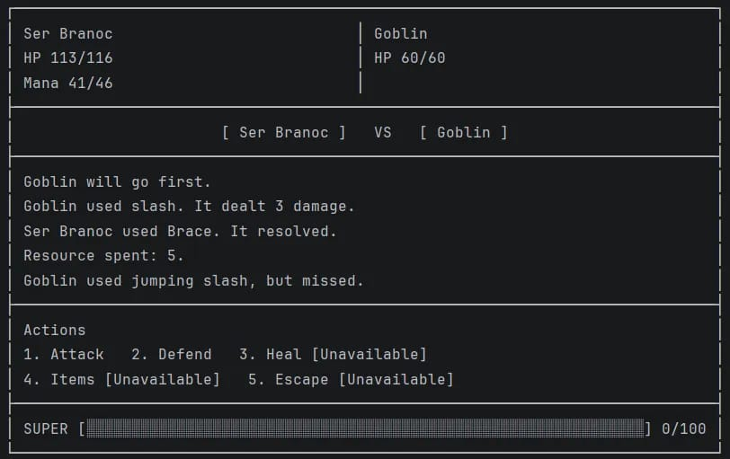
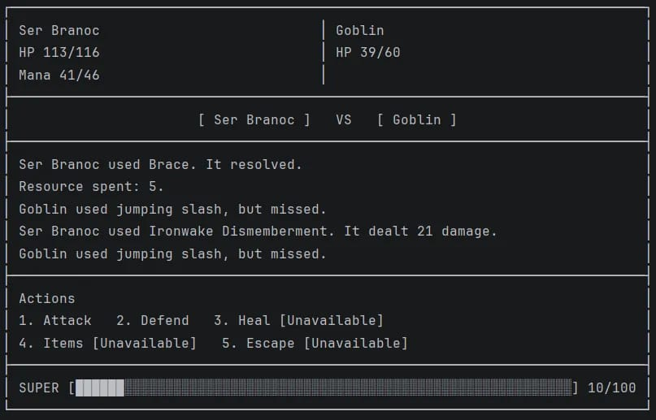

# Dungeon Drifters

Dungeon Drifters is a text-based Python RPG prototype set in the land of Ketlyv.

The current repository checkpoint is **v0.4**. It preserves the complete v0.3
single-Drifter surface campaign through the Goblin Lord and adds the portable
content-authoring foundation, unified project layout, deterministic catalogs,
scaffolding, and validation tooling. M11 acceptance proves the complete session
for all four Drifters.

## Current Playable State

The current playable flow is:

```text
title screen
  -> Drifter selection
  -> opening story
  -> overworld route
  -> authored encounter
  -> rewards
  -> rest, inspect, save, load, or continue
  -> Goblin Lord victory
  -> dungeon entrance (current release endpoint)
```

Current Drifter selection uses canonical profile identity layered over the
existing mechanical archetypes:

- Ser Branoc, the Unbroken Crest - Brawler
- Azhvielle, the Unconfessed - Black Mage
- Zhaivra Kelyth, the Uncontrolled Reagent - Rogue Archer
- Joruun Veyr, the Bloody Storm Monk - Monk

The surface route contains eight authored encounters:

```text
Goblin
-> 2 Goblins
-> Goblin Warrior
-> 2 Goblin Warriors
-> Goblin Shaman
-> 2 Goblin Shamans
-> Goblin Elite + Goblin
-> Goblin Lord + Goblin + Goblin Warrior
```

The route also contains three single-use Rest nodes. Rest fully restores HP
and Mana without changing Super or other persistent state; continuing without
resting advances the route without recovery.

The battle menu presents:

- Attack
- Defend
- Heal
- Items
- Escape

Attack and Super open structured move submenus when eligible moves are
available. Heal is a universal self-heal action with a three-action cooldown.
Defend is a core combat action. Items opens each character's personal run
inventory; Zhaivra can prepare Fire or Poison Infused Barb payloads. Escape
remains visible but disabled. Super is persistently visible through the meter
and opens its submenu when ready.

Branoc's Brace, Azhvielle's Gravemantle and Frost routes, Zhaivra's Burn and
Poison infusions, and Joruun's Water, Air, Lightning, and Stun mechanics are
implemented through the resolver and encounter-local state boundaries.

Multi-enemy battles preserve authored order, stable target identity, exact
target selection, and defeated-enemy visibility. The overworld menu provides
Character, Items, Map, Options, and contextual route actions. Character and
Skills screens expose progression, permanent stats, Growth Points, and
signature weapon data. Rewards are applied once after complete encounter
victory.

Manual save/load uses one file at `root/src/saves/dungeon_drifters.json`. Disk saves
use schema 8; the in-memory inspection snapshot remains schema 7. Battle and
other temporary runtime state are never written to disk.

## Play Instructions

From the `root/` project directory, run:

```powershell
..\.venv\Scripts\python.exe src\run_game.py
```

You can also run `root/src/run_game.py` directly from PyCharm.

During play:

1. Press Enter past the title screen.
2. Choose a Drifter.
3. Confirm or return to selection.
4. Read the opening story.
5. Enter the first encounter from the overworld menu.
6. Choose Attack, Defend, Heal, Items, or Escape during combat.
7. Select an exact enemy target when an encounter has multiple living enemies.
8. Use Heal when damaged and ready; it becomes available again after three
   later accepted actions by that character.
9. Use the persistent Super meter to open the Super submenu when ready.
10. Use the overworld menu to inspect the route, spend Growth Points, rest,
    save, load, or quit with confirmation.

## Balance Snapshot

The permanent M9 balance probe captures the pre-progression roster with fixed
seed banks and real combat routes:

```powershell
..\.venv\Scripts\python.exe tools\balance_probe.py
```

Each run records Markdown, raw JSON, and metadata under
`root/tools/balance_probe_outputs/<run_id>/`. The canonical M9 snapshot uses eight
route policies, 25 Goblin seeds, 100 stress seeds, and 1,000 total encounters.
It also records natural Super usage and the exact commit, seed corpus, and
route policy versions used for the run. Generated runs are ignored so they can
be retained locally and zipped for later balance review.

## Screenshots

The current terminal presentation is shown below:



*Structured move menu showing authored roles, resource costs, Brace rules, and the dynamic Ironwake payoff label.*



*Battle HUD showing the five ordinary actions, unavailable-state labels, bounded battle log, and persistent Super meter.*



*Battle log after Brace and an empowered Ironwake Dismemberment action.*

## Implemented Architecture

The repository now includes these active foundations:

- `GameState` as the session root for one active run.
- `PlayerState`, `StoryState`, and `WorldState` ownership boundaries.
- `app.content` as the authoring facade for immutable enemy, weapon, Drifter,
  encounter, and route specifications, plus its committed generated catalog.
- Generic `Character` and `PlayerState` runtime state with canonical Drifter
  identity attached from the content catalog.
- Health, mana, level, EXP, permanent stats, and effective stat access.
- Central player stat-scaling helpers for HP, Mana, output scaling, physical
  negation, accuracy, dodge, Super gain, and crit chance.
- Inventory, gold, and equipment slot state on `PlayerState`.
- Immutable validated `Move` definitions.
- Immutable validated `MoveResult` as the structured combat result contract.
- Inert authored move-presentation metadata for roles, affinities, and summaries.
- Shared `Combatant` protocol for player and enemy runtime state.
- Runtime `EnemyState` with independent health, mana, stats, and structured
  enemy moves.
- Enemy archetype metadata for rank, role, behavior, capabilities, and tier.
- `app.combat` contains reusable combat rules and contracts, while
  `app.enemies` contains generic enemy definition and runtime contracts.
- `tools` provides development-time content discovery, scaffolding, catalog
  generation, and read-only validation; runtime loading uses only the tracked
  deterministic catalog and never scans the filesystem.
- Core Defend contract integrated into Battle as a resolver-backed core action,
  not an authored `Move`.
- Battle consumes `CombatResolver` and passes `CombatState` into resolver calls.
- Battle reads player moves from `player_state.combat_moves` and authored enemy
  moves from each independent `EnemyState`.
- Accepted combat actions complete through
  `CombatState.complete_accepted_action(...)`.
- `BattlePresenter` converts read-only domain state and semantic events into
  immutable `BattleView` models.
- `BattlePresentationSession` owns bounded encounter-local structured log
  history.
- `TerminalBattleUI` owns terminal layout, wrapping, ANSI/Unicode fallback,
  input translation, and rendering, but no combat state or history.
- Battle accepts typed semantic input, validates it against the offered view,
  and contains no direct terminal `input()` or `print()` calls.
- The resolver owns validation, resource spending, accuracy, damage, healing,
  Super behavior, and result creation.
- Player starting HP and Mana now derive from Constitution, Spirit, and level
  through the stat-scaling contract instead of hardcoded archetype resource
  constants.
- Combat damage output now uses basis-point primary stat scaling instead of raw
  additive stat damage, and ordinary physical negation, accuracy, dodge, Super
  gain, and crit chance are wired through the shared scaling helpers.
- Serializable `PlayerState` and `GameState` snapshots.
- Defensive copies or immutable views for state collections where currently
  implemented.

These systems preserve the v0.3 gameplay foundation. v0.4 adds the portable
content-authoring and project-structure foundation described in the change log.
The session ends at the dungeon entrance; entering the dungeon, companion
recruitment, party state, and dungeon gameplay remain deferred to a later
release.

## Resource Terminology

The active `Move` resource categories are:

- `None`
- `Mana`
- `Super`

Momentum is deferred shared encounter state. It is not an active move resource.

Ki may appear as Joruun identity or technique flavor. It is not an active
resource state.

Momentum and Ki meters remain deferred. Character-specific compounds and
prepared infusions are active through each character's personal run state;
they are not shared party resources.

## Test Instructions

Code commands below run from the `root/` project directory. From the repository
root, enter it first with `Set-Location root`.

Install development dependencies:

```powershell
..\.venv\Scripts\python.exe -m pip install -r requirements-dev.txt
```

Run the full pytest suite:

```powershell
..\.venv\Scripts\python.exe -m pytest
```

Run a compile check:

```powershell
..\.venv\Scripts\python.exe -m compileall src tests tools
```

## Project Structure

```text
Dungeon-Drifters/
+-- .github/
|   +-- workflows/
|       +-- tests.yml
+-- root/
|   +-- src/
|   |   +-- app/
|   |   +-- run_game.py
|   +-- tests/
|   +-- tools/
|   +-- pytest.ini
|   +-- requirements-dev.txt
+-- docs/
+-- res/
+-- README.md
+-- .gitignore
```

The complete runnable game is contained under `root/src/`. Tests, tools, and
Python project configuration live under `root/`; documentation, resources, and
repository metadata remain at the repository level.

## Change Log

The complete version history is maintained in the [change log](docs/change/change%20log.md).

## Known Limitations

- In-battle Escape remains visible but is not yet wired.
- Heal is a universal self-heal that restores 10-16 HP plus effective
  Constitution and becomes available again after three later accepted
  actions by that character.
- Character balance remains provisional pending broader balance review.
- Exact combat formulas and balance are provisional.
- Secured and unsecured extraction loops remain deferred.
- Momentum implementation is deferred.
- The current inventory and infusion loop is limited to the authored M9
  compounds and payloads; broader loot and crafting systems remain future
  work.
- Status effects and elemental interactions are limited to the authored M9
  mechanics; no general effect scripting system exists.
- Enemy AI is still simple random selection from authored structured moves.
- Party combat, ally targeting, and dungeon gameplay are not implemented.
- Area-targeting moves, enemy healing, enemy Defend, enemy Super, summons,
  phases, and tactical AI remain deferred.
- Equipment remains intentionally narrow: the authored signature weapon is
  inspectable, while accessory swapping and broader item systems remain
  future work.
- Crafting, shops, full loot tables, save slots, autosave, and cloud saves
  remain future work.

## Development Notes

- Use the project virtual environment at `.venv`.
- Use `.\.venv\Scripts\python.exe` for commands.
- Pytest is the canonical test runner.
- Use the [content authoring guide](docs/content%20creation/content%20authoring.md) to add
  enemies, weapons, Drifters, encounters, or routes through the supported
  scaffold and validation commands.
