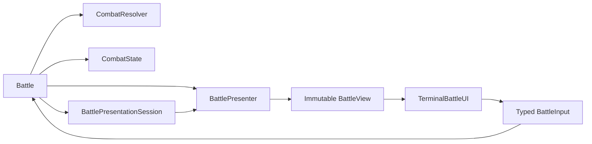

# M9 UI / Engine Separation Plan

## Document Status

```text
Planning contract: complete
Implementation status: not started
First code patch: UI-1A
Branch: m9-ui-engine-separation
Source-code baseline: 43198b7 Harden Brace resolver boundaries
Baseline working tree: clean
UI-0 repository artifact: m9-ui-engine-separation.md
```

UI-0 is complete as a planning contract. This Markdown file is the only approved UI-0 repository artifact. No production or test files were modified while producing it.

---

## Implementation Authority And Execution Policy

This document is the controlling implementation contract for the complete M9 UI / Engine Separation milestone.

X may implement the approved sequence without requesting approval between green patches. X must not reinterpret, widen, or silently revise the contract.

Execution rules:

- preserve the defined UI patch boundaries
- one completed patch equals one commit
- one completed patch equals one push to `m9-ui-engine-separation`
- run the required focused and full verification before each commit
- push each green commit before beginning the next patch
- allow branch CI to run for each pushed commit
- record the full commit SHA and CI result for every patch
- continue automatically while local verification and pushed CI remain green
- keep every commit independently reviewable
- do not combine multiple UI patches into one commit
- do not amend, squash, rebase, rewrite, or force-push completed patch commits
- do not merge into `v0.2.9` or `master`
- do not modify README or changelog

Stop immediately and report before continuing when:

- focused or full tests fail
- compileall or `git diff --check` fails
- pushed CI fails
- a combat mechanic or accepted-action lifecycle contract must change
- Resolver or `MoveResult` behavior must change
- Heal, Items, or Escape require new gameplay
- the approved ownership boundary cannot be preserved
- an unexpected production dependency requires scope outside this document
- a test exposes an unresolved contract ambiguity
- unrelated files or behavior must change

UI-0 itself is committed and pushed as the plan-document checkpoint before UI-1A begins.

---

## Objective

Extract terminal input and presentation from `src/app/combat/battle.py` before M9B introduces additional dynamic character state.

This milestone creates a renderer-neutral battle presentation boundary without rewriting:

- combat mechanics
- targeting
- turn progression
- accepted-action completion
- temporary-state ownership
- player or enemy data

M9A demonstrated the need for this separation. Brace and its armed Heavy payoff are mechanically correct, but the existing terminal menu cannot clearly represent their dynamic state without adding presentation branches directly to `Battle`.

---

## Target Experience

### Move Menu

```text
Choose a move:

1. Crestgrave Reaping [Normal]
   Sunder-Spire tears through the target, cleaving guard and armor.

2. Cinderlung Vesper [Fire Magic | 3 Mana]
   A black war-breath erupts forward, searing everything in its path.

3. Brace [Utility | 5 Mana]
   Brace against the next enemy action, reducing physical damage by 40%,
   and empower your next Heavy attack by 30%.

4. Ironwake Dismemberment [Heavy]
   A crushing Sunder-Spire strike. Deals 30% more damage after Brace.

0. Back
```

While the Brace payoff is armed:

```text
4. Ironwake Dismemberment [Heavy | Empowered +30%]
```

“Next enemy action” is intentional because accepted opposing actions consume Brace protection even when they miss or deal non-physical damage.

### Persistent Battle HUD

```text
┌──────────────────────────────────────────────────────────────┐
│ Joruun Veyr                                      Goblin      │
│ HP   49/60                                      HP   40/60   │
│ Mana 13/20                                                   │
├──────────────────────────────────────────────────────────────┤
│                                                              │
│             [ CHARACTER / ENEMY VISUAL AREA ]                │
│                                                              │
├──────────────────────────────────────────────────────────────┤
│ Joruun strikes the Goblin.                                   │
│ The Goblin takes 12 damage.                                  │
│ The Goblin prepares to attack.                               │
├──────────────────────────────────────────────────────────────┤
│   [ 1. Attack ]   [ 2. Defend ]   [ 3. Heal ]                │
│   [ 4. Items  ]   [ 5. Escape ]                              │
├──────────────────────────────────────────────────────────────┤
│ SUPER  [██████████████████░░░░░░░░░░░░░░░░░░░░]             │
└──────────────────────────────────────────────────────────────┘
```

When a Super move is affordable:

```text
│ SUPER  [████████████████████████████████████████] READY [S]  │
```

The intended hierarchy is:

```text
PLAYER / ENEMY STATUS
CHARACTER VISUALS
BATTLE LOG
ATTACK · DEFEND · HEAL · ITEMS · ESCAPE
PERSISTENT SUPER METER
```

---

## Architectural Boundary



### Battle

Owns:

- encounter flow
- turn ownership
- interaction phase
- semantic-input validation
- target selection
- resolver calls
- accepted-action completion
- victory and defeat checks
- recording semantic presentation events

Must not own:

- terminal formatting
- `print()` or `input()`
- text wrapping
- colors or borders
- combat formulas
- temporary mechanic state
- retained UI rendering state

### CombatResolver

Continues to own:

- move validation
- targeting validation
- resource spending
- accuracy
- dodge
- damage
- healing
- critical resolution
- Super gain
- mechanical `MoveResult` creation

No UI work belongs in the resolver.

### CombatState

Continues to own:

- Defend state
- Brace state
- temporary encounter state
- accepted-action completion
- temporary-state expiry
- turn count

It may expose narrow, non-consuming observation methods for presentation.

### BattlePresenter

Owns:

- conversion of read-only domain state into immutable views
- action availability
- move presentation
- resource display values
- dynamic presentation tags
- Super-meter state
- temporary-state labels

It must remain pure and stateless.

### BattlePresentationSession

Owns:

- encounter-local structured presentation history
- bounded log retention
- semantic input-rejection events
- resolved-action events

It does not own combat state and is not persisted in snapshots.

### TerminalBattleUI

Owns:

- terminal rendering
- width detection
- wrapping
- borders
- Unicode and ASCII fallback
- optional ANSI styling
- screen refresh behavior
- input aliases
- translation of raw input into typed `BattleInput`

It must retain no battle log or gameplay state.

---

## Immutable View Rule

`BattleView` must contain only:

- immutable dataclasses
- tuples
- strings
- integers
- booleans
- presentation enums

It must not expose:

- `PlayerState`
- `Character`
- `EnemyState`
- `CombatState`
- `Move`
- mutable resource containers
- resolver objects
- presentation-session objects

This allows another renderer to consume the same view without understanding Python combat internals.

---

## Semantic Input Contract

Battle must never receive terminal strings or menu indices.

```python
class ActionIntent(StrEnum):
    ATTACK = "attack"
    DEFEND = "defend"
    HEAL = "heal"
    ITEMS = "items"
    ESCAPE = "escape"
    SUPER = "super"


@dataclass(frozen=True)
class ChooseAction:
    intent: ActionIntent


@dataclass(frozen=True)
class ChooseMove:
    move_key: str


@dataclass(frozen=True)
class GoBack:
    pass


BattleInput = ChooseAction | ChooseMove | GoBack
```

Terminal translation examples:

```text
"1"       -> ChooseAction(ActionIntent.ATTACK)
"defend"  -> ChooseAction(ActionIntent.DEFEND)
"S"       -> ChooseAction(ActionIntent.SUPER)
"4"       -> ChooseMove(offered_move_key)
"0"       -> GoBack()
```

`move_key` may temporarily contain `Move.name` because that is the resolver’s current lookup contract.

It remains opaque:

- UI must not parse it.
- Battle must not branch on its wording.
- Presenter must not infer mechanics from it.
- Stable move IDs remain a later schema migration.

---

## Interaction Phase Contract

```python
class InteractionPhase(StrEnum):
    ACTIONS = "actions"
    REGULAR_MOVES = "regular_moves"
    HEALING_MOVES = "healing_moves"
    SUPER_MOVES = "super_moves"
```

Every `BattleView` explicitly declares its interaction phase.

| Phase | Valid ordinary input | Back |
|---|---|---|
| `ACTIONS` | Offered `ChooseAction` values | No |
| `REGULAR_MOVES` | Offered regular `ChooseMove` values | Yes |
| `HEALING_MOVES` | Offered non-Super healing moves | Yes |
| `SUPER_MOVES` | Offered Super moves | Yes |

`ChooseAction(SUPER)` may be offered from any phase when Super is ready. It transitions to `SUPER_MOVES` without advancing the turn.

`InteractionPhase` is encounter-flow state owned by `Battle`. It is not `CombatState` and is not saved.

---

## Offered-Intent Enforcement

The UI improves usability, but Battle enforces the interaction contract.

```text
Presenter builds BattleView
-> UI renders that view
-> UI returns BattleInput
-> Battle validates input against that exact view
-> Battle dispatches valid input
```

Rules:

- `ChooseAction` must match an offered and enabled action.
- `ChooseMove.move_key` must match an offered and enabled move.
- `GoBack` is valid only during a move-selection phase.
- `ChooseAction(SUPER)` must match an enabled Super meter.
- Invalid semantic input must not reach the resolver.
- Invalid semantic input must not mutate CombatState.
- Invalid semantic input must not spend resources.
- Invalid semantic input must not complete an action.
- Invalid semantic input must not advance the turn.
- Invalid semantic input leaves the same actor active.

Resolver validation remains authoritative for:

- targets
- affordability
- move support
- actor/target validity
- mechanical acceptance

Battle validates whether an intent was offered. Resolver validates whether the resulting combat action is mechanically valid.

---

## Input Rejection

Malformed terminal text should normally be handled inside `TerminalBattleUI` before returning a `BattleInput`.

An unavailable or unoffered semantic input returned by a buggy or scripted adapter produces a structured presentation event with a renderer-neutral reason code:

```python
class InputRejectionReason(StrEnum):
    ACTION_UNAVAILABLE = "action_unavailable"
    MOVE_UNAVAILABLE = "move_unavailable"
    BACK_UNAVAILABLE = "back_unavailable"
    SUPER_UNAVAILABLE = "super_unavailable"


BattleLogEntry(
    event_type=BattleEventType.INPUT_REJECTED,
    rejection_reason=InputRejectionReason.ACTION_UNAVAILABLE,
)
```

The terminal renderer may present that code as:

```text
That action is not available.
```

Final user-facing prose must not be retained in the semantic event. The event must not create a `MoveResult`, because no combat action was attempted.

---

## Primary Presentation Models

```text
CombatantView
ActionOptionView
MoveOptionView
SuperMeterView
BattleLogEntry
BattleVisualView
BattleView
```

### CombatantView

Contains:

- display name
- current and maximum HP
- relevant current and maximum Mana
- relevant current and maximum Super
- Defend indicator
- temporary presentation labels

### ActionOptionView

Contains:

- action intent
- displayed number
- label
- enabled state
- disabled reason

### MoveOptionView

Contains:

- selection key
- displayed number
- move name
- presentation tags
- rules summary
- resource label
- enabled state
- disabled reason

### SuperMeterView

Contains:

- current Super
- maximum Super
- normalized fill
- ready state
- activation key
- whether activation is offered

### BattleLogEntry

Contains structured event data rather than terminal prose.

Reasons and rejection details must use presentation enums or stable semantic codes. They must not store final player-facing sentences.

### BattleVisualView

Contains immutable visual references or fallback lines.

It must not contain image objects or mutable asset handles.

### BattleView

Contains:

- interaction phase
- player view
- enemy view
- action options
- move options for the current phase
- Super meter
- structured log entries
- visual view

---

## Structured Battle Log

`BattlePresentationSession` retains the bounded semantic history.

Initial contract:

```text
Maximum retained entries: 20
Standard HUD target: newest entries that fit at least 3 visible lines
```

The terminal renderer may show fewer or more entries depending on width and wrapping, but it never owns retention.

Conceptual entry:

```python
BattleLogEntry(
    event_type=BattleEventType.DAMAGE,
    actor_name="Ser Branoc",
    target_name="Goblin",
    action_name="Ironwake Dismemberment",
    accepted=True,
    hit=True,
    amount=21,
    critical=False,
    resource_spent=0,
    reason=None,
)
```

Initial event categories should cover:

- encounter start
- initiative
- damage
- critical damage
- miss
- healing
- Defend
- utility resolution
- rejected action
- unavailable semantic input
- victory
- defeat

Terminal punctuation, wrapping, color, and icons remain renderer-owned.

---

## Pure Presenter Contract

```python
view = presenter.build(
    player=player,
    enemy=enemy,
    combat_state=combat_state,
    log_entries=session.entries,
    interaction_phase=phase,
)
```

The presenter may:

- read actor resources
- read authored moves
- read immutable move-presentation metadata
- call non-consuming CombatState queries
- calculate display-only availability
- produce fresh immutable view objects

The presenter must not:

- retain the presentation session
- retain a previous view
- consume Brace payoff
- clear temporary state
- mutate actors
- mutate resources
- advance turns
- call the resolver
- format terminal borders or prose
- validate combat mechanics

---

## Move Presentation Contract

`Move` may receive an optional immutable authored presentation object.

Conceptual shape:

```python
class MoveRole(StrEnum):
    NORMAL = "normal"
    HEAVY = "heavy"
    UTILITY = "utility"
    HEALING = "healing"
    SUPER = "super"


@dataclass(frozen=True)
class MovePresentation:
    role: MoveRole
    affinity_label: str | None
    static_summary: str
```

The resolver must never inspect presentation metadata.

Presentation metadata may provide:

- Normal
- Heavy
- Utility
- Healing
- Super
- non-mechanical affinity labels such as Fire
- static summary text

Resource labels are derived from existing move data:

```text
ResourceType.NONE + 0       -> no cost tag
ResourceType.MANA + 3       -> 3 Mana
ResourceType.SUPER + 100    -> 100 Super
```

Summary precedence is locked:

```text
When MovePresentation.static_summary is present:
    use static_summary

Otherwise:
    fall back to Move.description
```

`Move.description` remains valid domain-authored fallback text. Presentation code must not concatenate both summaries or maintain duplicate independent copy.

Static tag composition is locked:

```text
Normal physical damage move:
[Normal]

Normal magical move with affinity:
[<Affinity> Magic]

Heavy move:
[Heavy]

Utility move:
[Utility]

Healing move:
[Healing]

Super move:
[Super]
```

Cinderlung Vesper therefore uses:

```text
role = Normal
affinity_label = Fire
damage_type = Magical

rendered category:
[Fire Magic]
```

It must not render as `[Normal | Fire]`.

Tag ordering is locked:

```text
static role or category
-> dynamic state
-> resource cost
```

Examples:

```text
[Normal]
[Fire Magic | 3 Mana]
[Utility | 5 Mana]
[Heavy | Empowered +30%]
[Super | 100 Super]
```

Dynamic tags are presenter-owned:

```text
[Heavy | Empowered +30%]
```

Dynamic state must not be written into:

- `Move.name`
- `Move.description`
- `Move.mechanic`
- `MoveResult`
- legacy `.moves`

Branoc receives the first complete authored presentation metadata. Other moves may use deterministic generic presentation fallback until their M9 kit pass authors richer metadata.

---

## Brace Rules Source

Brace’s rule values must have one public mechanics source.

Conceptual shape:

```python
@dataclass(frozen=True)
class BraceRules:
    incoming_reduction_percent: int = 40
    follow_up_damage_bonus_percent: int = 30
    follow_up_mechanic: str = "heavy_attack"


BRACE_RULES = BraceRules()
```

CombatState, resolver behavior, tests, and presentation must consume this source.

The values `40` and `30` must not be independently duplicated in terminal formatting.

This is a Brace-specific contract, not a generic status or modifier framework.

---

## Non-Consuming Brace Queries

Add narrow read-only CombatState methods:

```python
brace_follow_up_damage_bonus_percent(actor, move_mechanic) -> int
brace_incoming_protection_active(actor) -> bool
```

The follow-up query:

- returns the active bonus for a matching mechanic
- returns `0` when inactive or nonmatching
- never consumes the payoff
- never mutates state
- uses object identity
- exposes no `_brace_states`

The incoming-protection query:

- returns whether the protection window is active
- does not apply damage reduction
- does not consume protection
- exposes no internal state

The existing consuming follow-up method remains resolver-only.

---

## Action Hierarchy

The permanent ordinary action row is:

```text
1. Attack
2. Defend
3. Heal
4. Items
5. Escape
```

### Attack

Opens `REGULAR_MOVES`.

Includes:

- non-Super `MoveKind.DAMAGE`
- non-Super `MoveKind.UTILITY`

The submenu heading is:

```text
Choose a move:
```

Brace remains part of Branoc’s regular authored kit.

### Defend

Continues through:

```python
CombatResolver.resolve_defend(...)
```

Defend remains:

- universal
- separate from authored moves
- separate from Brace
- an accepted action when resolver-approved

### Heal

Opens `HEALING_MOVES`.

It may route only:

- already-authored
- already-resolver-supported
- non-Super `MoveKind.HEALING` moves

This milestone must not:

- add a universal heal
- author new healing moves
- change healing formulas
- change healing targeting
- add healing AI

Heal remains disabled when the actor has no eligible healing moves.

### Items

Remains visible but disabled.

No inventory-combat behavior is added.

### Escape

Remains visible but disabled.

The existing pre-battle flee path is not converted into in-battle Escape.

### Super

Super is not assigned an ordinary action number.

`S` opens `SUPER_MOVES` when at least one authored Super move is affordable.

Super remains mechanically unchanged.

---

## Super Meter Contract

Normal state:

```text
SUPER [██████████████░░░░░░░░░░] 40/100
```

Ready state:

```text
SUPER [████████████████████████] 100/100 READY [S]
```

Readiness is based on whether at least one authored Super move is affordable.

The presenter derives readiness. The resolver still validates spending and acceptance.

Super activation may be offered from any interaction phase because the meter is persistent.

Selecting Super:

- changes to `SUPER_MOVES`
- does not spend Super
- does not advance the turn
- does not call the resolver until a specific Super move is selected

---

## Battle Lifecycle

The accepted-action lifecycle must remain:

```text
UI returns typed intent
-> Battle validates intent against presented view
-> Battle navigates or selects actor/target
-> Resolver returns MoveResult
-> presentation session records semantic event
-> Battle calls complete_accepted_action only when accepted
-> Battle returns interaction phase to ACTIONS
-> presenter builds the next BattleView
-> UI renders the new view
```

Navigation input:

- changes interaction phase only
- never calls the resolver
- never advances the turn

Rejected resolver action:

- records a structured rejection
- does not complete the accepted action
- does not advance the turn
- does not clear Defend
- does not expire Brace protection
- keeps the actor active
- remains in the relevant interaction phase

Accepted action:

- records the result
- completes through CombatState
- advances according to the existing contract
- returns to `ACTIONS`

---

## TerminalBattleUI Contract

Recommended protocol:

```python
class BattleUI(Protocol):
    def render(self, view: BattleView) -> None:
        ...

    def read_input(self, view: BattleView) -> BattleInput:
        ...
```

`TerminalBattleUI` receives injected input and output functions or streams for deterministic tests.

It owns:

- terminal width detection
- interaction-phase headings
- menu numbering
- alias parsing
- malformed raw-input feedback
- wrapping
- borders
- optional ANSI
- Unicode versus ASCII rendering
- screen refresh behavior
- final prose generation from structured events

It does not own:

- log retention
- enabled-state calculation
- move affordability calculation
- targeting
- action completion
- combat state
- current turn
- current interaction phase
- resource mutation

---

## Terminal Capability Rules

Initial layout modes:

```text
80+ columns: full HUD
60–79 columns: compact HUD
below 60 columns: linear fallback
```

Required behavior:

- interactive terminals may use ANSI refresh
- redirected output uses append-only rendering
- tests run with ANSI disabled
- Unicode borders are optional
- ASCII fallback must preserve all information
- color must never be the only state indicator
- unavailable actions require visible text or symbols
- wrapping must not overlap adjacent regions
- dynamic content must not resize unrelated regions incoherently

Do not add a terminal graphics dependency during this milestone.

---

## Character Visual Area

UI-4 establishes a `BattleVisualView` and a stable visual region.

Initial implementation may use:

- authored ASCII or Unicode lines
- a neutral placeholder
- name-based labels supplied through presentation data

It must not:

- add an image asset pipeline
- load mutable image objects into `BattleView`
- branch on character names inside the terminal renderer
- change character or enemy domain objects solely for terminal art

Graphical assets remain a later presentation-content patch.

---

## Target File Layout

Expected new production areas:

```text
src/app/combat/brace.py
src/app/combat/move_presentation.py

src/app/presentation/__init__.py
src/app/presentation/battle_models.py
src/app/presentation/battle_session.py
src/app/presentation/battle_presenter.py

src/app/ui/__init__.py
src/app/ui/battle_ui.py
src/app/ui/terminal_battle_ui.py
```

Expected existing production files touched across the milestone:

```text
src/app/combat/battle.py
src/app/combat/combat_state.py
src/app/combat/move.py
src/app/player/loadouts/branoc.py
src/app/game/main_loop.py
```

Possible existing utility integration:

```text
src/app/game/console.py
```

Do not duplicate console-clearing behavior without first checking this module.

---

# Implementation Sequence

## UI-0 — Interaction Contract

### Status

Complete as a planning contract.

### Locks

- typed `BattleInput`
- explicit `InteractionPhase`
- action grouping
- disabled-action behavior
- persistent Super access
- Battle-side offered-intent validation
- structured log ownership
- presenter purity
- terminal fallback rules
- Heal interpretation
- non-goals

### Code

No production or test code.

The only UI-0 repository artifact is:

```text
m9-ui-engine-separation.md
```

Commit and push this plan-document checkpoint before UI-1A begins.

### Gate

UI-1A may begin only after the UI-0 plan commit is pushed and its branch CI is green.

---

## UI-1A — Brace Rules And Read-Only Queries

### Purpose

Centralize Brace’s mechanics-facing constants and expose non-consuming presentation queries.

### Expected Changes

```text
src/app/combat/brace.py
src/app/combat/combat_state.py
tests/test_combat_state.py
```

Touch `resolver.py` only if required to consume the centralized rule source without behavior changes.

### Required Tests

- centralized values remain 40% and 30%
- activation still uses the accepted values
- follow-up query returns 30 for armed `heavy_attack`
- follow-up query returns 0 when inactive
- follow-up query returns 0 for nonmatching mechanics
- query does not consume payoff
- repeated query remains stable
- incoming-protection query reports active/inactive correctly
- queries support unhashable combatants
- identity does not depend on names
- existing consuming method still consumes exactly once
- resolver damage remains unchanged

### Non-Changes

- no UI models
- no Move changes
- no Battle changes
- no terminal changes
- no mechanic behavior changes

### Gate

CombatState-focused tests and full suite pass.

---

## UI-1B — Inert Move Presentation Metadata

### Purpose

Provide authored display identity without changing resolver behavior.

### Expected Changes

```text
src/app/combat/move_presentation.py
src/app/combat/move.py
src/app/player/loadouts/branoc.py
tests/test_character_move_data.py
tests/test_character_loadout_regression.py
tests/test_move.py or equivalent
```

### Branoc Metadata

```text
Crestgrave Reaping      -> Normal
Cinderlung Vesper       -> Fire affinity / Magic display
Brace                    -> Utility
Ironwake Dismemberment  -> Heavy
Third Gate Obsequy      -> Super
```

### Required Tests

- metadata is immutable
- metadata validation rejects invalid role/summary values
- Move accepts optional presentation metadata
- `static_summary` is retained as inert authored metadata
- missing `static_summary` permits the presenter to fall back to `Move.description`
- all existing Move mechanics remain unchanged
- resolver ignores presentation metadata
- Branoc metadata matches authored intent
- no resource, power, accuracy, target, or mechanic values change
- legacy `.moves` remains untouched

### Gate

Move/loadout tests and full suite pass.

---

## UI-1C — Immutable Views, Events, And Session

### Purpose

Add renderer-neutral presentation structures without integrating Battle yet.

### Expected Changes

```text
src/app/presentation/battle_models.py
src/app/presentation/battle_session.py
tests/test_battle_presentation_models.py
tests/test_battle_presentation_session.py
```

### Required Tests

- all models are frozen
- collections are tuples
- invalid negative resources are rejected
- invalid maximum/current combinations are rejected as appropriate
- log retention is bounded
- oldest entries are discarded at capacity
- event order is preserved
- session exposes immutable entry snapshots
- session owns no CombatState
- no final terminal prose is stored
- no domain objects appear in BattleView

### Gate

Pure model tests and full suite pass.

---

## UI-1D — Pure BattlePresenter

### Purpose

Build immutable `BattleView` values from read-only combat state.

### Expected Changes

```text
src/app/presentation/battle_presenter.py
tests/test_battle_presenter.py
```

### Required Presenter Behavior

- builds player and enemy resource views
- includes relevant Mana and Super
- builds five ordinary action options
- enables Attack appropriately
- enables Defend
- enables Heal only with eligible healing moves
- disables Items
- disables Escape
- builds Super readiness
- filters moves by interaction phase
- creates resource labels
- applies the locked summary-precedence rule
- composes static, dynamic, and resource tags in the locked order
- renders Cinderlung as `Fire Magic`, not `Normal | Fire`
- creates generic fallback metadata
- reads Brace payoff without consuming it
- adds `Empowered +30%` only when armed
- remains stateless across builds

### Required Tests

- repeated builds are equal when state is unchanged
- builds do not mutate actors or CombatState
- Brace query remains non-consuming
- phase controls offered move categories
- disabled reasons are present
- no terminal formatting exists in views
- no domain objects leak into views

### Gate

Presenter tests and full suite pass.

---

## UI-2A — Battle UI Protocol And Adapters

### Purpose

Define the presentation port before removing direct Battle I/O.

### Expected Changes

```text
src/app/ui/battle_ui.py
src/app/ui/terminal_battle_ui.py
tests/test_battle_ui_contract.py
tests/test_terminal_battle_ui.py
```

A scripted fake adapter should live in test support unless production use is justified.

### Required Tests

- raw numbers map to `ChooseAction`
- aliases map correctly
- `S` maps to Super
- move numbers map to offered move keys
- `0` maps to `GoBack` only where valid
- malformed input reprompts locally
- disabled choices are not returned as normal user input
- adapter retains no log history
- adapter does not mutate the supplied view
- rendering works with injected streams

### Compatibility Requirement

A minimal behavior-equivalent terminal renderer must exist before Battle’s direct I/O is removed.

No patch may leave the executable game without a functional battle UI.

### Gate

Contract and terminal-adapter tests pass.

---

## UI-2B — Extract Battle Input And Output

### Purpose

Remove terminal knowledge from Battle and enforce semantic-input validity.

### Expected Changes

```text
src/app/combat/battle.py
tests/test_battle_player_state.py
```

### Required Changes

- inject the UI port
- inject or create the presentation session per encounter
- build views through the presenter
- call `ui.render(view)`
- receive `BattleInput`
- validate against the exact offered view
- route valid actions
- record semantic events
- remove direct move-result printing
- remove direct HUD printing
- remove direct menu input

### Required Tests

- fake UI drives Battle deterministically
- Battle never receives terminal strings
- invalid offered-intent attempts do not call resolver
- disabled actions do not advance
- GoBack changes phase only
- Super can open from an offered phase
- resolver rejection retains actor and phase
- accepted actions complete exactly once
- enemy actions still use resolver
- Brace lifecycle remains unchanged
- Battle contains no gameplay presentation branches

### Migration Rule

Existing tests must be redistributed, not silently deleted:

- orchestration assertions remain Battle tests
- text-format assertions move to terminal tests
- direct private renderer tests are replaced by structured-event or adapter tests

### Gate

Focused Battle tests and full suite pass.

---

## UI-2C — Composition Root

### Purpose

Construct the production terminal adapter outside Battle.

### Expected Changes

```text
src/app/game/main_loop.py
src/app/game/console.py only if needed
tests/test_main_flow_player_state.py
tests/smoke_test_vertical_slice.py if required
```

### Required Changes

- `main_loop.py` creates `TerminalBattleUI`
- `main_loop.py` injects it into Battle
- final Battle constructor has no hidden production-terminal dependency
- story flow remains unchanged
- existing pre-battle flee remains unchanged

### Gate

Main-flow tests, smoke tests, and full suite pass.

---

## UI-3 — Structured Move Menu

### Purpose

Deliver readable authored and dynamic move presentation.

### Required Output

```text
1. Crestgrave Reaping [Normal]
2. Cinderlung Vesper [Fire Magic | 3 Mana]
3. Brace [Utility | 5 Mana]
4. Ironwake Dismemberment [Heavy]
```

When armed:

```text
4. Ironwake Dismemberment [Heavy | Empowered +30%]
```

### Required Tests

- no `[none 0]`
- Mana labels are readable
- Cinderlung renders exactly as `[Fire Magic | 3 Mana]`
- summary precedence uses `static_summary` before `Move.description`
- static, dynamic, and resource tags retain the locked order
- descriptions wrap beneath move names
- Back appears only in move phases
- Brace rules use centralized values
- Ironwake changes dynamically without state mutation
- accepted Heavy hit removes the tag afterward
- accepted Heavy miss removes the tag afterward
- rejected Heavy preserves the tag
- nonmatching move preserves the tag
- Super remains separate

### Manual Gate

Perform a Branoc battle confirming:

```text
Brace -> enemy action -> empowered Ironwake
```

---

## UI-4 — Persistent HUD And Super Meter

### Purpose

Implement the full battle hierarchy.

### Required Sections

```text
status
visuals
battle log
ordinary actions
Super meter
```

### Required Tests

- player HP/Mana/Super render correctly
- enemy relevant resources render correctly
- Defend state is visible
- Brace-relevant state is visible where approved
- five ordinary actions remain stable
- disabled actions are visible
- Super is never ordinary action 4
- Super meter is always present
- READY appears only when usable
- `S` remains independently available
- structured log preserves event order
- layouts work at 120, 80, and 60 columns
- ASCII mode preserves all meaning
- ANSI-disabled output remains readable
- no text overlaps or escapes panels

### Manual Gate

Verify interactive Windows 11 terminal behavior and redirected-output fallback.

---

## UI-5 — Regression Hardening

### Purpose

Close the separation milestone without adding features.

### Required Coverage

- all four Drifter move rosters display and resolve
- Branoc dynamic Brace presentation works
- regular moves remain resolver-driven
- enemy moves remain resolver-driven
- Defend remains universal/core
- accepted-action completion remains CombatState-owned
- rejected actions preserve actor and temporary state
- Super gain and crit behavior remain unchanged
- Items and Escape remain disabled
- Heal remains category-only where no authored healing move exists
- Battle has no direct `print()` or `input()`
- TerminalBattleUI retains no encounter state
- presenter remains pure
- Goblin encounter completes

### Manual Gate

Complete the Goblin encounter with each Drifter when practical.

This is a playability gate, not a balance gate.

---

## Standard Verification

After every implementation patch and before its commit:

```powershell
.\.venv\Scripts\python.exe -m pytest <focused tests>
.\.venv\Scripts\python.exe -m pytest
.\.venv\Scripts\python.exe -m compileall src tests
git diff --check
git status --short
```

UI-3 through UI-5 also require relevant manual terminal checks.

When all required local gates pass:

```text
commit that patch separately
push that commit to m9-ui-engine-separation
wait for or verify branch CI
record the full SHA and CI result
continue to the next patch only while CI remains green
```

A failed local gate must stop before commit. A failed pushed CI gate must stop before the next patch.

---

## Commit And Push Contract

The milestone uses a strict reviewable history:

```text
UI-0  -> one plan-document commit -> push
UI-1A -> one implementation commit -> push
UI-1B -> one implementation commit -> push
UI-1C -> one implementation commit -> push
UI-1D -> one implementation commit -> push
UI-2A -> one implementation commit -> push
UI-2B -> one implementation commit -> push
UI-2C -> one implementation commit -> push
UI-3  -> one implementation commit -> push
UI-4  -> one implementation commit -> push
UI-5  -> one implementation commit -> push
```

Each patch commit must contain only that patch’s approved scope.

Do not:

- combine patches
- amend a completed patch commit
- squash commits
- rebase or rewrite completed patch history
- force-push
- merge into `v0.2.9`
- merge into `master`
- modify README or changelog

This history exists so M can review the complete milestone afterward one patch diff at a time.

---

## Reporting Contract

Maintain a running implementation record while working. After each pushed patch, record:

```text
patch name
state impact
contracts added or changed
files changed
focused tests
full pytest
compileall
git diff --check
pre-commit working-tree status
commit message
full commit SHA
push result
CI run link
CI status and conclusion
manual test result when required
what changed
what did not change
```

Do not pause for approval between green patches.

Stop and report immediately under the stop conditions in the Implementation Authority And Execution Policy section.

After UI-5, provide one consolidated report containing the complete ordered commit list and every patch result so M can review each diff independently.

---

## Explicit Non-Goals

Do not implement during this milestone:

- universal healing
- new healing moves
- Items
- in-battle Escape
- party targeting
- multi-enemy targeting
- Android UI
- browser UI
- image asset pipeline
- generic status/effect engine
- Burn, Poison, Bleed, or Stun
- XP
- Growth Points
- save/load changes
- Battle mechanics rewrite
- resolver mechanics rewrite
- enemy or Goblin rebalance
- move power or cost changes
- legacy `.moves` removal
- README or changelog updates

---

## Known Transitional Limits

- `Move.name` remains the temporary resolver and presentation selection key.
- Only Branoc initially receives complete authored presentation metadata.
- Other Drifters may use generic fallback labels until their M9 identity passes.
- Character visuals begin with immutable fallbacks, not an asset system.
- Story screens still use the existing console path.
- Party and Android interfaces remain future adapters.

These limits must be documented rather than silently “solved” by expanding scope.

---

## Completion Gate

The UI/engine separation is complete when:

- `Battle` contains no direct `input()` or `print()`.
- Battle accepts only typed semantic input.
- Battle validates input against the exact offered view.
- `BattlePresenter` is pure and stateless.
- `BattleView` contains no mutable domain objects.
- `BattlePresentationSession` owns bounded structured history.
- `TerminalBattleUI` owns no retained encounter state.
- Brace values have one mechanics source.
- Brace and Ironwake dynamic presentation is non-consuming.
- Super is persistently visible and independently activated.
- unavailable actions cannot advance turns.
- all four Drifter move sets remain compatible.
- the Goblin vertical slice remains playable.
- UI-0 through UI-5 each exist as a separate pushed commit.
- every pushed patch CI gate is green.
- no completed patch history was amended, squashed, rebased, or force-pushed.
- full pytest passes.
- compileall passes.
- `git diff --check` passes.
- the working tree is clean after the final pushed patch.

---

## Line To Protect Hardest

> Presentation may observe combat state and return semantic intent. It may never decide, consume, or mutate combat mechanics.